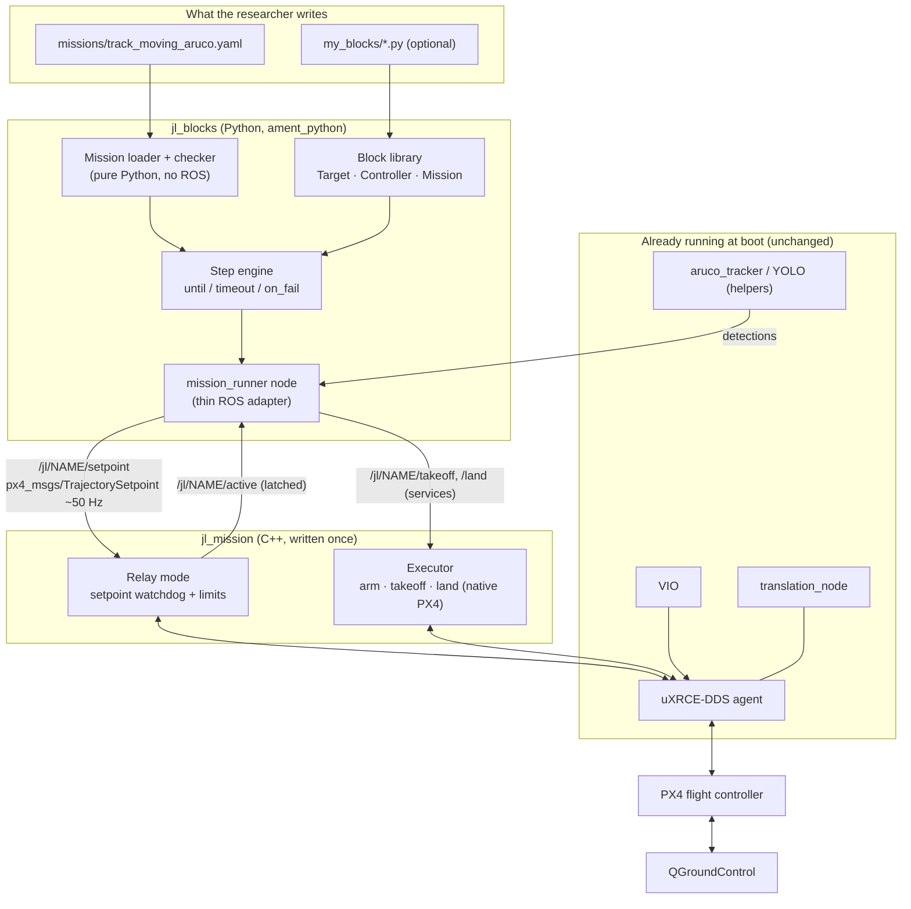
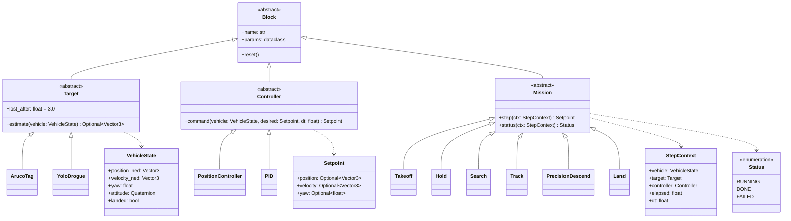
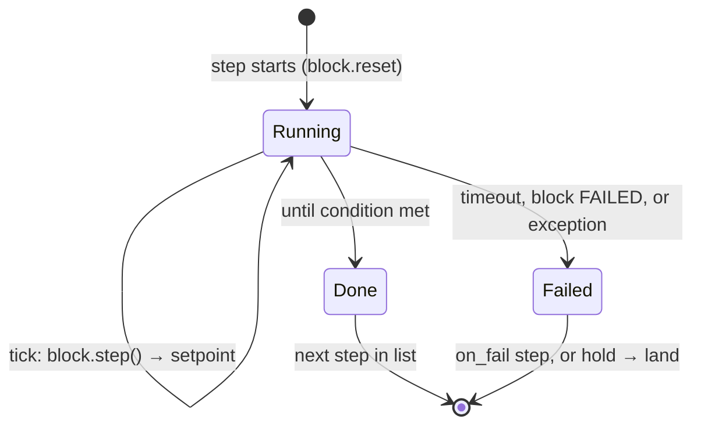
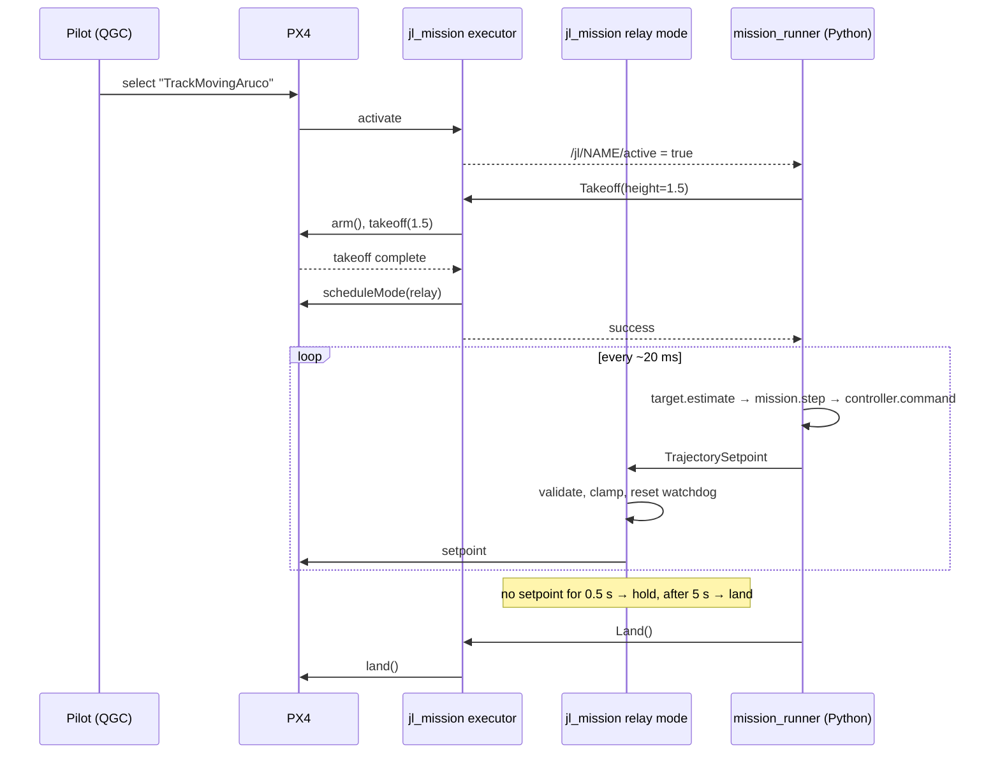

# Mission blocks: compose autonomous missions from reusable blocks

Date: 2026-09-21
Status: design approved in conversation, awaiting review of this written spec

## 1. Goal

Jacob's Ladder is for undergraduate researchers who can't be expected to know
every discipline a drone touches. Today, flying a new behavior means writing a
C++ external mode and executor, adding a systemd unit, and knowing which checks
prove the vehicle is ready. This spec replaces that with three things a beginner
can handle:

1. Blocks: small Python classes of three kinds. A *target* answers "where is
   the thing?", a *controller* answers "how do I get there?", and a *mission*
   answers "what am I trying to do, and am I done?". The project ships a library
   of blocks, and researchers can write their own.
2. Mission files: YAML that strings blocks together into steps, so a mission
   reads like the executor state machines in `general_docs/external_modes.md`,
   e.g. "take off, search for a moving ArUco tag, track it with a PID
   controller, land".
3. One deploy command, run on the drone. It pulls, checks and builds the code,
   registers the listed missions so they appear in QGroundControl at boot, and
   then reports whether the vehicle is actually ready.

**Success criterion.** A researcher whose mission works in SITL adds one line
to `config/flight.yaml`, runs `./deploy.sh` on the drone, and the mission
appears in QGC after every boot. They never write C++ or touch systemd.

Researchers who outgrow the blocks graduate to `src/example_autonomous_mode`
and the existing C++ tutorials, which stay unchanged.

## 2. Architecture

Python holds all mission logic. One generic C++ external mode is the only
component that talks to PX4, and it enforces the safety contract whatever the
Python side does.



### Package layout

| Package | Language | Contents |
|---|---|---|
| `jl_blocks` | Python (`ament_python`) | `core/` (block base classes, registry, loader, checker, step engine: **no ROS imports**), `library/` (shipped blocks), `ros/` (the `mission_runner` node), CLI `jl_blocks check` |
| `jl_mission` | C++ (`ament_cmake`) | the relay mode and executor, one executable per registered mission instance |
| `jl_mission_interfaces` | IDL | `Takeoff.srv` (`float32 height` → `bool success, string message`); `land` uses `std_srvs/Trigger` |

Keeping `jl_blocks.core` free of ROS means every block and the whole step
engine can be unit-tested with plain `pytest`, locally and in CI, without a ROS
install.

Setpoints use `px4_msgs/TrajectorySetpoint`, the message PX4 itself uses, with
PX4's convention that NaN means "not controlled on this axis". Blocks never
build it by hand; they return a `Setpoint` dataclass (position and/or velocity,
yaw) that the runner converts.

## 3. Blocks



**Writing a block.** One file, one class, registered by name with a decorator.
Parameters are a dataclass, so defaults, types and units are declared once and
drive both validation and documentation:

```python
@block("pid")
class PID(Controller):
    @dataclass
    class Params:
        kp: float = 0.8          # 1/s
        ki: float = 0.0
        kd: float = 0.2
        max_speed: float = 1.0   # m/s

    def command(self, vehicle, desired, dt): ...
```

**Shipped blocks (first release).** Each is a port of behavior that already
flies, so it has a known-good reference:

| Kind | Block | Ported from |
|---|---|---|
| Mission | `takeoff`, `hold`, `land` | `TakeoffLand` / `TakeoffHold` executors (native PX4 calls via the executor) |
| Mission | `search` (`pattern: hold` or `spiral`) | `PrecisionLand` search state |
| Mission | `track` (`standoff`) | `DroneSmoothPlanner` carrot + standoff logic |
| Mission | `precision_descend` | `PrecisionLand` descend state |
| Target | `aruco_tag` (`camera: front`/`down`) | `aruco_tracker` output + the camera→NED transform in `FrontApproach` / `PrecisionLand` |
| Target | `yolo_drogue` | `pose_estimation_node` output + `DroneSmoothPlanner::drogueTargetNed` |
| Controller | `position` | pass the desired position to PX4 (today's default) |
| Controller | `pid` | the PID in `FrontApproach` |

Target blocks consume the existing perception nodes' topics. They don't
replace `aruco_tracker` or YOLO, which run as helpers (section 7).

## 4. Mission files

```yaml
# missions/track_moving_aruco.yaml
name: TrackMovingAruco            # shown in QGC
target:
  aruco_tag: {camera: front}      # tag id and size: aruco_tracker's own params
controller:
  pid: {kp: 0.8, ki: 0.0, kd: 0.2, max_speed: 1.0}

steps:
  - takeoff: {height: 1.5}
  - search:  {pattern: hold}
    until: target_seen
    timeout: 30
    on_fail: land
  - track:   {standoff: 2.0}
    until: never
    on_fail: search
  - land: {}
```

Rules, all enforced by the loader before anything registers with PX4:

- Every key names a registered block, and its params must match that block's
  `Params` dataclass. An unknown name or param fails with a suggestion:
  `unknown param 'kpp' for pid; did you mean 'kp'?`
- The target and controller are declared once at the top. A step may override
  either (e.g. `precision_descend` with `aruco_tag: {camera: down}`).
- `until` is one of `done` (the default, meaning the block's own `status()`),
  `target_seen`, `target_lost` (no estimate for `lost_after` seconds), `never`,
  or a number of seconds.
- `timeout` is the number of seconds after which the step fails.
- `on_fail` names the step to jump to. Without it, a failure means hold, then land.
- A step's name defaults to its block name; add `name:` to use a block twice.
  Every `on_fail` target must exist.
- If the pilot switches modes in QGC, the mission stops. The next activation
  starts it again from step 1.

There are no variables, loops or expressions. Needing more means writing a
Python block, or graduating to `example_autonomous_mode`.



## 5. The `jl_mission` safety contract

These hold whatever the Python side does:

| Rule | Behavior | Default (parameter) |
|---|---|---|
| Silence means hold | no valid setpoint for `silence_hold_s` → hold the last position | 0.5 s |
| Prolonged silence lands | still silent after `silence_land_s` → land | 5 s |
| Invalid means hold | a setpoint with Inf, with neither position nor velocity fully set, or more than `max_step_m` from the current position is rejected (logged) and treated as silence | 5 m |
| Speed limit | velocity clamped to `max_speed`, and a position setpoint moves toward its target at most `max_speed` per second; a mission may lower it, never raise it past the airframe limit | 1 m/s |
| Native takeoff/arm/land | only the executor calls PX4's `arm()`, `takeoff()`, `land()`. `takeoff()` gets current AMSL + height (NaN, i.e. `MIS_TAKEOFF_ALT`, without a global position); the relay mode then climbs to exactly the requested height, and the takeoff request is answered only when the vehicle is within `climb_tolerance_m` of it | 0.1 m |
| Pilot wins | a mode switch in QGC deactivates immediately; PX4 failsafes (RC loss, battery, geofence) apply unchanged | n/a |

How failures reach the researcher:

| Failure | Result |
|---|---|
| Mission file fails to load | nothing registers; `deploy.sh` / `jl_blocks check` print the error |
| Block raises in flight | runner logs the traceback, the step fails → `on_fail`, or hold → land |
| Runner process dies | silence → hold → land after 5 s; ROS launch restarts the runner, but it does **not** resume mid-flight |
| Everything | visible on `/jl/NAME/state` (current step, why it ended) and `/tracking_error` |

`/jl/NAME/state` is published by the mission_runner (Phase 3): the current
step and why it ended. `jl_mission`'s own relay/hold/landing states publish
to `/jl/NAME/mode_state` instead, so the two never collide.

`jl_mission` follows the `precision_land` conventions: `StatePublisher`,
`TrackingErrorPublisher`, and TakeoffHold's wait-for-FMU + registration retry
loop in `main()`.

One control tick and the takeoff hand-off:



## 6. Spike result: Python setpoints fly like in-process ones

Before writing this spec, a throwaway spike tested the design's one risky assumption: that a
Python node sending setpoints over ROS at 50 Hz, relayed by a C++ external
mode, tracks as well as setpoints computed in-process. One relay mode flew the
same schedule (hover at 1.5 m, step 1 m north, then silence) from both sources,
headless in `jacob_ladder_sim` (PX4 v1.16.0 SITL, `gz_x500`, x86 desktop).
Single run per source:

| Metric | In-process (C++) | Python → relay |
|---|---|---|
| Hover RMS error | 0.058 m | 0.026 m |
| 1 m step, settle to within 0.1 m | 1.92 s | 1.90 s |
| Step overshoot | 0.054 m | 0.029 m |
| RMS error after the step | 0.021 m | 0.023 m |
| Hold after the Python sender stops | n/a | 0.018 m RMS, watchdog fired at +0.5 s |
| Setpoint inter-arrival | n/a | p50 20.0 ms, p99 22.8 ms, max 27.6 ms |

Phase 5 added `ros2 run jl_blocks setpoint_timing --name NAME` to repeat this
measurement anywhere. SITL baseline with the full runner (Phase 5, 2026-09-25;
30-second sample during a 60-second hold):
`setpoint inter-arrival over 1501 messages: p50 20 ms, p99 20.5 ms, max 21 ms`.
**Still to do on the Jetson** under flight load (VIO + YOLO): run it during a
hold and record the result here before the first real mission flight.

The two sources are equivalent within run-to-run noise, and the 0.5 s watchdog
has roughly 20× margin over the worst observed gap. None of this has been
measured on the Jetson under flight load (VIO + YOLO) yet, so the implementation
plan repeats the measurement there before the first real flight.

## 7. Deployment

```yaml
# config/flight.yaml: what this airframe registers at boot
missions:
  - missions/track_moving_aruco.yaml
  - missions/takeoff_hold.yaml
helpers: [vio]      # extra boot services the missions need (aruco_tracker, yolo, ...)
```

`./deploy.sh`, run on the Jetson over its hotspot, in order, stopping at the
first failure:

1. `git pull`, refusing if there are uncommitted local changes, so the drone
   always matches a commit.
2. `jl_blocks check` on every listed mission. A bad file stops here, and nothing
   already running is touched.
3. `colcon build --packages-up-to jl_blocks jl_mission` plus the helpers'
   packages, and nothing else.
4. Enable and start `jl_mission@<name>` (relay + executor + runner) for each
   listed mission and each listed helper; disable those not listed.
5. Readiness report, one line per check:
   ```
   ✓ DDS agent session established    (journal, not just /fmu topic names)
   ✓ FC data arriving                 /fmu/out/vehicle_status --once
   ✓ VIO publishing                   /fmu/in/vehicle_visual_odometry  30 Hz
   ✓ Registered in PX4                TrackMovingAruco, TakeoffHold
   ✗ aruco_tracker                    no detections on /front/target_pose (fine if no tag in view)
   ```

`./deploy.sh --check` runs only step 5 and is the preflight command. The
existing boot units (`dds_agent`, `translation_node`, `vio`) are unchanged.
`jl_mission@.service.in` is one more template rendered by
`services/install_services.sh`, with `Restart=always` for the same reason
`takeoff_hold.service` uses it.

## 8. Testing and linting

| Level | What | Tool | Needs |
|---|---|---|---|
| L0 lint | Python style and types; C++ format for `jl_mission` | `ruff check`, `ruff format --check`, `ty`, `clang-format` (reuse `src/example_autonomous_mode/.clang-format`) | nothing |
| L0 mission lint | every `missions/*.yaml` loads: known blocks, valid params, `on_fail` targets exist | `jl_blocks check` | nothing |
| L1 unit | each block against a fake `VehicleState`; the step engine's `until` / `timeout` / `on_fail` on a fake clock; the loader's error messages | `pytest` | no ROS |
| L1 unit (C++) | watchdog, validation and clamping as pure functions | `ament_cmake_gtest` | colcon |
| L3 SITL | a mission flies headless and its step events on `/jl/NAME/events` arrive in the expected order (e.g. `takeoff → search → track`), plus optional checks: finished, and where the front camera sees the target | `test/sitl_mission.sh <mission.yaml> --expect "…"`; every L3 flight: `test/sitl_all.sh` | `jacob_ladder_sim` |
| L4 hardware | props-off, then tethered hover | README "Before You Fly" | a human |

- `make check` runs L0 and L1 in seconds; `make sitl-test` runs L3.
- A GitHub Actions workflow runs `make check` on every push and PR on a plain
  Ubuntu runner, which works because `jl_blocks.core` has no ROS dependency.
- Each block's unit test is written first and seen to fail (TDD).
- The first L3 acceptance test is the ArUco demo in
  `src/drogue_flight/docs/aruco_sitl.md`, rewritten as a mission file
  (`track` + `aruco_tag`). It must reproduce the 3 m standoff within ±0.25 m per axis.
- `pytest` is added to the dev dependencies in `pyproject.toml`.

### SITL harness requirements

Building the ArUco demo and the spike turned up these requirements. The L3 harness must:

- start PX4 with `-d` (no interactive shell; without a TTY it spins and filled
  a 1 GB log in minutes) and `-w <fresh dir>`, so tests never inherit or modify
  the developer's saved SITL parameters;
- pin `GZ_PARTITION`, since Gazebo derives the default from the username;
- set `NAV_DLL_ACT 0` in that fresh parameter set, because there is no GCS;
- retry mode selection slowly (≥ 10 s apart): re-selecting mid-takeoff restarts
  the executor;
- run headless. The GUI launch scripts are for people watching or recording,
  not for tests.

## 9. Implementation phases

Each phase ends green on its own tests and is usable on its own:

1. `jl_blocks.core`: block bases, registry, dataclass params, loader, checker,
   step engine, with unit tests and the `jl_blocks check` CLI. Add `pytest` and
   the CI workflow here.
2. `jl_mission` + `jl_mission_interfaces`: relay mode, executor, watchdog,
   validation and limits, with gtests.
3. `mission_runner` node and the shipped blocks, ported one at a time, each
   with a unit test.
4. `test/sitl_mission.sh` and the ArUco acceptance mission (L3).
5. `config/flight.yaml`, `jl_mission@.service.in`, `deploy.sh` and the
   readiness report; repeat the spike's timing measurement on the Jetson.
6. Docs: a beginner tutorial ("your first mission file", "your first block"),
   linked from the README next to `example_autonomous_mode`.

## 10. Out of scope

Each gets its own design later:

- Jetson provisioning (`DRONE_SETUP.md`, `installation_scripts/setup_system.py`).
- Flight-controller firmware and parameter management.
- New perception: target blocks only wrap the existing `aruco_tracker` and YOLO
  outputs.
- Resuming a mission after a runner restart mid-flight.

## 11. Open items for the maintainer

- Phase 5 deploy decisions: "disable those not listed" applies to `jl_mission@*` and the known helpers only (dds_agent/translation_node/takeoff_hold are never touched); deploy refuses while armed; the runner is respawned by launch inside `jl_mission@` (jl_mission stays up so its watchdog holds, then lands); mission names used by other boot services are rejected.
- `deploy.sh` has only run against stubs and `--dry-run`. Its first real run should be on the drone with props off, watching `./deploy.sh --check` afterwards.
- `make format` points at an `astylerc` that isn't in the repo, so it silently
  skips. Either add the file or drop that path; this spec uses `clang-format`
  for the new C++.
- In SITL, the native `takeoff()` completion callback fires at about 0.7 m
  instead of the requested height (seen with `DroneSmoothPlanner` and its 1.75 m
  target: the callback beat its altitude watcher). The `jl_mission` executor
  should report takeoff success only once the vehicle reaches the requested
  height, rather than trusting the callback.
- Resolved in Phase 3: a mission block's `step()` may return an `Action` (`takeoff` / `land`); the engine hands it out once (`Engine.take_action()`), the runner calls `jl_mission`, and the reply arrives in `StepContext.action`. A finished mission holds; a mission that should land ends with a `land` step.
- Resolved in Phase 3: the loader enforces jl_mission's name rule (at most 24 characters), so `jl_blocks check` catches it.
- `jl_mission` has only been flown in SITL. Before its first real flight, check on the drone what `takeoff()` does with no global position (the NaN / `MIS_TAKEOFF_ALT` path) and that the Climb phase reaches the requested height under VIO.
- Phase 4's ArUco acceptance measures the 3 m standoff in the front camera's frame (the tag at (0, 0, 3) ± 0.25 m for 5 s, as `aruco_tracker` reports it), not against Gazebo ground truth: the tag's local-frame height depends on the EKF origin and the camera mount, which move it by about 0.2 m.
