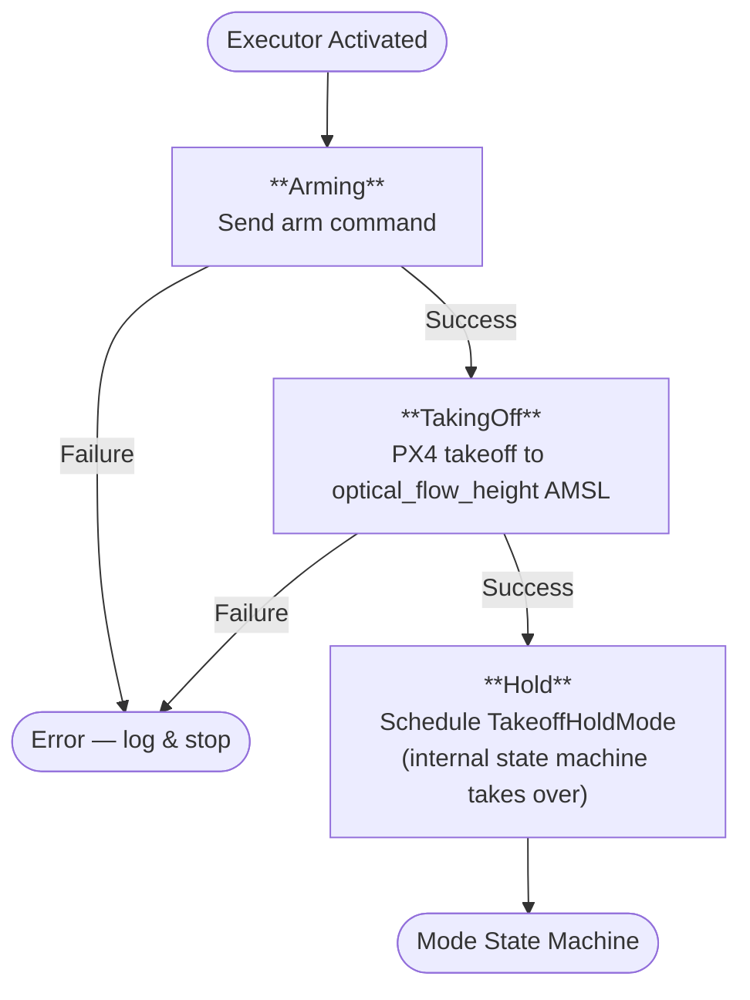
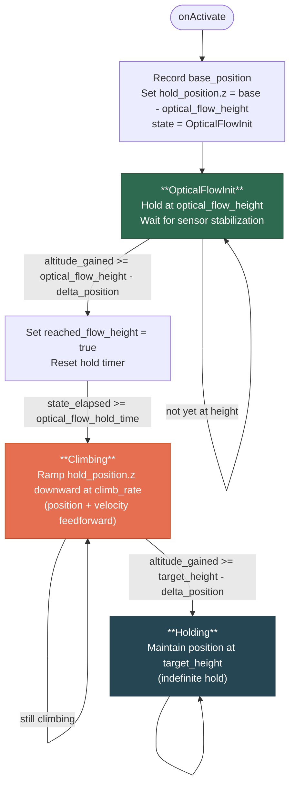
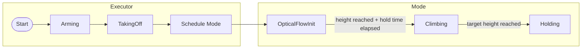

# TakeoffHold State Machine

## Overview

TakeoffHold is a two-layer state machine that arms the drone, performs a low takeoff
for optical-flow sensor initialization, then smoothly climbs to the target altitude
and holds position.

**Parameters** (set via ROS 2 launch/yaml):

| Parameter | Default | Description |
|---|---|---|
| `optical_flow_height` | 0.5 m | Low hover altitude for optical flow lock |
| `optical_flow_hold_time` | 3.0 s | Time to hold at optical flow height |
| `target_height` | 1.25 m | Final hold altitude |
| `climb_rate` | 0.3 m/s | Vertical climb speed |
| `delta_position` | 0.25 m | Position tolerance for "reached" checks |

---

## Executor Flow (TakeoffHoldExecutor)

The executor handles arming and the initial PX4 takeoff command, then hands control
to the mode's internal state machine.

---

## Mode Flow (TakeoffHoldMode)

Once the executor schedules the mode, the internal state machine manages the climb
profile and final hold.

---

## Combined End-to-End View

