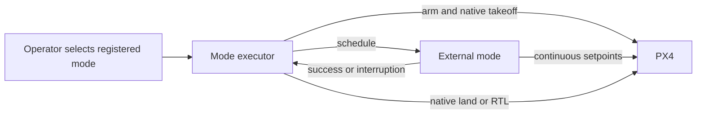

# External modes

PX4 external modes are flight modes implemented on a companion computer with ROS 2. They register with PX4 and appear alongside built-in modes in QGroundControl. Use one when the mission needs custom continuous control, such as following a target, while still letting PX4 manage mode selection, arming checks, and configured failsafes. The [PX4 ROS 2 Control Interface guide](https://docs.px4.io/v1.16/en/ros2/px4_ros2_control_interface) describes the registration and mode requirements.

An external **mode** sends setpoints while selected. An optional **mode executor** sequences operations around it: arm, PX4-native takeoff, schedule the mode, land or RTL, and wait for disarm. The executor is useful when a mission should do more than hold or track after the pilot selects a mode. For a working example of both classes, start with [`example_autonomous_mode`](../src/example_autonomous_mode/README.md). [`precision_land/BlankMode.cpp`](../src/precision_land/BlankMode.cpp) is a smaller example without an executor; it expects the pilot to arm and select the mode separately.

The mode needs a supported `px4_ros2` setpoint type, a unique registered name, and appropriate position or other vehicle inputs. Our example uses `OdometryLocalPosition` and `TrajectorySetpointType`. A mode can be selected by the operator, by another PX4 mechanism, or by its executor; registering the node alone does not start a mission. The [example state diagram](../src/example_autonomous_mode/README.md#how-the-pieces-fit) shows the split in a real workflow.

## Registration and message versions

The registered name is serialized into [`RegisterExtComponentRequest.name`](../src/px4_msgs/msg/RegisterExtComponentRequest.msg), a `char[25]` field. The [registration implementation](../src/px4-ros2-interface-lib/px4_ros2_cpp/src/components/registration.cpp) rejects a name of 25 or more characters, leaving 24 usable characters. Keep it unique across modes connected to the autopilot. PX4 uses a hash of the name to preserve an external mode's switch index across startup-order changes; see [Assigning a Mode to an RC Switch](https://docs.px4.io/v1.16/en/ros2/px4_ros2_control_interface#assigning-a-mode-to-an-rc-switch-or-joystick-action).

PX4 firmware, `px4_msgs`, and the interface library must agree on message definitions. This workspace uses the [PX4 message translation node](https://docs.px4.io/main/en/ros2/px4_ros2_msg_translation_node). For this checkout, call `setSkipMessageCompatibilityCheck()` in **both** the mode and executor constructors; the version check otherwise rejects registration. Skipping that check does not itself translate messages. Start the translation node as described in the [workspace setup](../README.md), and keep the message versions pinned to the versions used by this project.

## Setpoints and failsafes

The selected mode must keep publishing the setpoints required by its active control type. The interface library requests a timer rate from the setpoint type; its default is 50 Hz, while `updateSetpoint(float dt_s)` receives the measured interval and is not guaranteed to run on an exact 20 ms schedule. Use `dt_s` for motion integration. [PX4's setpoint configuration](https://docs.px4.io/main/en/msg_docs/SetpointConfig) has a setpoint timeout; the registration and arming-check path also detects unresponsive modes. This is different from ROS 2 Offboard mode's `OffboardControlMode` proof-of-life stream.

If the active external mode crashes, stops responding, loses a required position estimate, or stops supplying setpoints, PX4 may enter its configured failsafe. The action depends on the aircraft's safety settings; it is not always an immediate disarm. A landing detector topic is not required to keep a mode alive. The example subscribes to `VehicleLandDetected` only to locate the ground for its optional controlled descent, then lets PX4's native landing handle touchdown and disarm. See [PX4 mode requirements and failsafes](https://docs.px4.io/v1.17/en/ros2/px4_ros2_control_interface#failsafes-and-mode-requirements).

## Finding the registered mode in QGroundControl

1. Launch the node and wait for successful registration.
2. Open QGroundControl's **MAVLink Console** and run `commander status`.
3. Find `External Mode N: nav_state: ..., name: ...` and match its name and number to the external-mode entry in the flight-mode selector or switch assignment.

The sketch is illustrative rather than a screenshot from a connected aircraft. If the entry is missing, check node registration, PX4/DDS connectivity, message translation, and the name length. If it appears but cannot be selected, inspect mode requirements and PX4 status messages.

PX4 local position uses the North-East-Down frame:

Positive z points down, so climbing makes z smaller and a positive z velocity commands descent. Check the requested frame and units whenever you add a new setpoint type.

## Adding a mode to this workspace

Copy the two example C++ files into an existing ROS 2 package, rename the classes and registered mode name, and add the source file and dependencies to that package's `CMakeLists.txt`. Copy the example's YAML and launch file if you want its parameter and launch structure. The [step-by-step example instructions](../src/example_autonomous_mode/README.md#using-the-classes-in-another-package) cover the names, state transitions, and build entries. Keep debug topics such as `/drone_state` and `/tracking_error` if useful; they are optional and are not part of PX4 mode registration.
