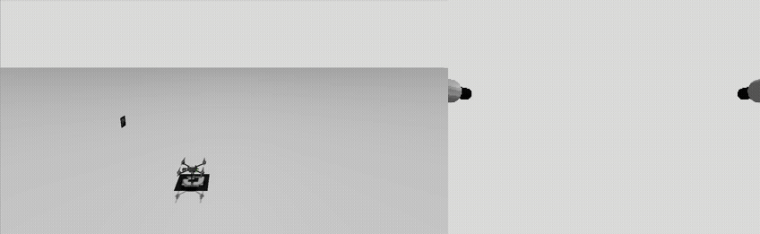
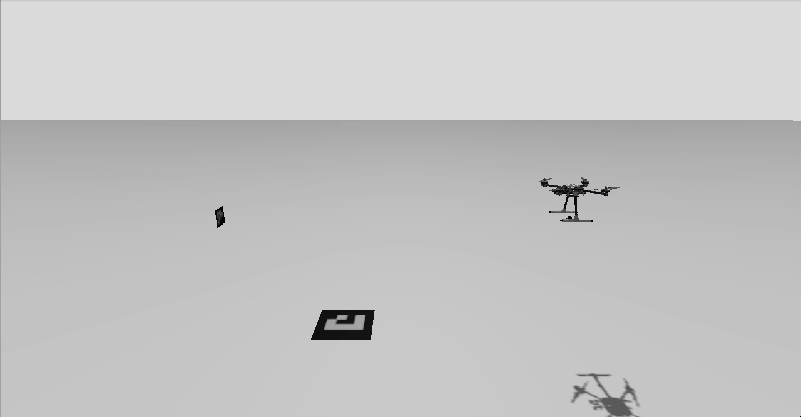
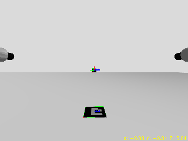

# DroneSmoothPlanner in SITL, chasing an ArUco tag

`DroneSmoothPlanner` flies to a standoff point in front of the drogue that the YOLO
pipeline detects. The simulation has no drogue, so it uses an ArUco tag instead. The
planner itself is unmodified: it is the same code the real drone flies.



*Left: Gazebo side view. The vertical tag is on the left, and the drone takes off from the
ground tag and backs away to its standoff. Right: the front camera as `aruco_tracker`
annotates it. The tag's axes are drawn, and the yellow readout is the tag position in
metres (Z = forward distance, settling at 3.00). GIF plays at 1.5× speed.*

| Holding the 3 m standoff | What the front camera sees |
|---|---|
|  |  |

## What it shows

From the planner's own log (`drogue_standoff_m: 3.0`, `final_waypoint_tolerance_m: 0.25`):

```
Takeoff complete — handing off to DroneSmoothPlanner mode
Drogue acquired — approaching to 3.00 m standoff
State: Search -> Approach
Reached 3.00 m standoff (error NED [-0.00, -0.21, -0.15] m) — holding station and tracking drogue
State: Approach -> Hover
[Hover] error NED: [N +0.00, E -0.01, D +0.01] m | drogue NED: [-0.05, 1.09, -0.95] | pos: [0.04, -1.91, -0.96]
```

The tag is 1 m east of the spawn point and 1 m up, and the planner estimates it at
NED ≈ (0, 1.1, -1.0). The drone climbs to the tag's altitude and holds 3 m back along its
approach line (E ≈ -1.9). Once it settles, each axis is within about 1 cm.

## How it is wired

```
Gazebo front camera ──ros_gz_bridge──▶ aruco_tracker ──/front/target_pose──▶ aruco_to_ranging.py
                                                                                │  flips x, y
                                                                                ▼
                                                   DroneSmoothPlanner ◀──/tag_detections
```

`aruco_tracker` reports the tag in OpenCV's optical frame (+x right, +y down, +z forward).
The YOLO pose node, and so the planner, use a ranging frame (+x left, +y up, +z forward).
`aruco_to_ranging.py` flips x and y and republishes the pose on `/tag_detections`. It is the
only code written for the simulation.

## Running it

```bash
./docker/run_sim_container.sh            # once: GUI container for this checkout
# once, inside it: make px4_sitl (in PX4-Autopilot), then colcon build (in this repo)
./launch_scripts/aruco_smooth_planner.sh
```

Then select **DroneSmoothPlanner** in QGroundControl. The world (`gazebo/worlds/aruco_dual_ids.sdf`)
and vehicle (`gazebo/models/x500_dual_cam`) load straight from this repo, so nothing has to be
copied into PX4-Autopilot.

## Known behaviour

PX4's native `takeoff()` reports completion at about 0.7 m, not the configured 1.75 m
`takeoff_height`, so the planner starts its approach from there. That doesn't matter in this
world, because the planner climbs to the tag's altitude anyway. The real drone runs the same
code, so this page records the behaviour instead of changing it.
