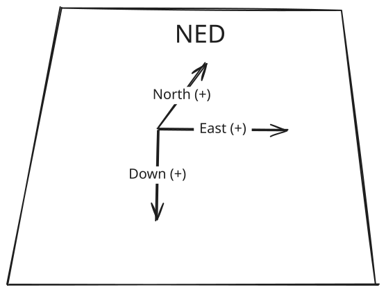

# example_autonomous_mode

A complete, working PX4 **external mode + executor workflow** in one file pair,
meant to be read start to finish and then copied. It arms, takes off to a low
hover, holds, descends, lands, and disarms — nothing else. Every autonomous mode
in this workspace is this shape with more mission states in the middle.

If you want an _empty_ skeleton rather than a working mode, see
`precision_land/BlankMode.cpp` (launched by `launch_scripts/offboard_blank.sh`).
That one registers with PX4 and does nothing, which is useful when you already
know the framework. Start here instead if you want to see a mode that actually
flies, with parameters, a state machine, and debug topics wired up.

## External Mode and Executor

PX4 supports custom modes that run on the companion computer instead of the
flight controller. The node registers a mode with PX4 through `px4_ros2`, and it
then appears in QGroundControl next to Stabilized, Position, and Mission. While
the mode is active it must keep sending setpoints; if the companion computer
stops talking, PX4 failsafes on its own.

The two classes divide the work deliberately:

- `ExampleAutonomousModeExecutor` owns the operation around the custom mode:
  arm, PX4-native takeoff, schedule the mode, PX4-native landing, and wait for
  disarm.
- `ExampleAutonomousMode` owns continuous flight behavior while scheduled:
  settle optical flow, hold, and send the controlled-descent setpoints.

Keeping those responsibilities separate prevents the custom mode from having
to arm itself or reimplement PX4's takeoff and final-touchdown behavior.

## State Machine

```
Executor: Arming --> TakingOff --> RunningMode --> Landing --> WaitingForDisarm
                                      |
Mode:                  OpticalFlowSettling --> Holding --> Descending --> Finished
```

| Mode state                  | What it does                                                                                                                                                |
| --------------------------- | ----------------------------------------------------------------------------------------------------------------------------------------------------------- |
| **Idle**                    | Not active. Entered on `onDeactivate()`.                                                                                                                    |
| **OpticalFlowSettling**     | Hold the position reached by native takeoff for `optical_flow_hold_time`, giving optical flow time to lock.                                                 |
| **Holding**                 | Hover at the current position for `hold_duration`. **This is where your own states go.**                                                                    |
| **Descending**              | Command `descent_vel` downward until reaching `landing_height` above the inferred ground plane, then hand final touchdown back to the Executor.              |
| **Finished**                | Hold position and report success to the Executor once.                                                                                                      |

## Build and Run

```bash
# From the workspace root, with PX4 SITL and the DDS agent already running
source /opt/ros/humble/setup.bash
colcon build --packages-select example_autonomous_mode
source install/setup.bash

ros2 launch example_autonomous_mode example_autonomous_mode.launch.py
```

The Executor activates automatically when it registers (`ActivateAlways`), so
the vehicle must be in a safe test environment before launching the node. It
then arms and runs the complete workflow without a manual takeoff.

## Parameters

Configured in `cfg/example_autonomous_mode_params.yaml`:

| Parameter                | Default | Unit | Description                                                                               |
| ------------------------ | ------- | ---- | ----------------------------------------------------------------------------------------- |
| `optical_flow_height`    | 0.25    | m    | Height of the initial low hover                                                           |
| `optical_flow_hold_time` | 3.0     | s    | How long to hold at that height                                                           |
| `delta_position`         | 0.05    | m    | Altitude tolerance used by the Executor's takeoff-completion watcher                       |
| `hold_duration`          | 7.5     | s    | How long to hover before descending                                                       |
| `descent_vel`            | 0.5     | m/s  | Downward speed during landing                                                             |
| `landing_height`         | 0.10    | m    | Height above inferred ground where controlled descent hands off to PX4-native landing      |

Override one at launch:

```bash
ros2 launch example_autonomous_mode example_autonomous_mode.launch.py
# or, to change a value permanently, edit cfg/example_autonomous_mode_params.yaml
```

## Debug Topics

| Topic             | Type                           | Description                                                                                                       |
| ----------------- | ------------------------------ | ----------------------------------------------------------------------------------------------------------------- |
| `/drone_state`    | `std_msgs/String`              | The state name, published on every transition                                                                     |
| `/tracking_error` | `geometry_msgs/Vector3Stamped` | Commanded minus actual position, in NED. If this grows instead of shrinking, PX4 is not following your setpoints. |

```bash
ros2 topic echo /drone_state
```

## Coordinate Frames

PX4 uses **NED** (North-East-Down), so **up is negative z**. The Executor's
takeoff-completion threshold is therefore negative:



```cpp
_takeoff_target_z = -(_optical_flow_height - _delta_position);
```


The takeoff watcher makes this threshold relative to its latest preflight local
z instead of assuming the ground is always `z = 0`. The mode likewise records
ground z while PX4 reports landed, with the configured takeoff height as a
fallback. Controlled descent stops `landing_height` above that plane so
PX4-native landing can perform final touchdown.

## Writing Your Own Mode

1. Copy this package to `src/your_mode`, then rename the package in
   `package.xml` and `CMakeLists.txt` (`project()`, the `add_executable` target,
   and the `install(TARGETS ...)` entry). ROS 2 package names must be lowercase
   with underscores — no hyphens. Then delete the README and assets folder as those are for the example documentation.
2. Change `kExampleAutonomousModeName` in the header. **This string must be unique across every mode registered with the same autopilot**, and PX4 caps it at 24 characters. Two nodes claiming one name will collide. For more details on the naming serialization, see the [PX4 documentation](https://docs.px4.io/main/en/ros2/px4_ros2_control_interface#replacing-an-internal-mode).
3. Add states to the `enum class State`, a `case` in `updateSetpoint()`, and a
   name in `stateName()`. The compiler will tell you if you miss the last one —
   the switch has no `default`, so `-Werror` catches unhandled values.
4. Add parameters in `loadParameters()` and to the YAML. Declare the compiled
   default as the fallback so the two cannot drift apart.
5. Put your continuous mission behavior between `OpticalFlowSettling` and
   `Descending`. Extend the Executor only when the surrounding workflow needs
   another PX4 operation before or after the custom mode.

`updateSetpoint()` is rate-limited to update at a maximum rate of 50 Hz for
this mode. The `dt_s` argument is the measured time since the previous
callback, so it may vary from 0.02 seconds. Use it to integrate —
`_hold_position.z() -= climb_rate * dt_s` is a rate-limited climb — rather than
assuming a fixed loop period.
