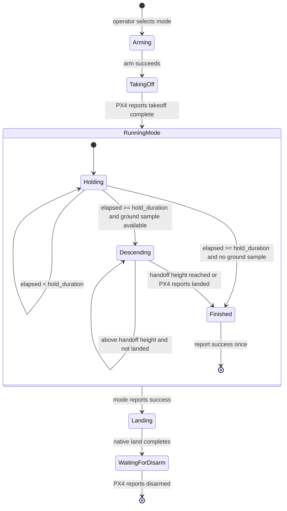
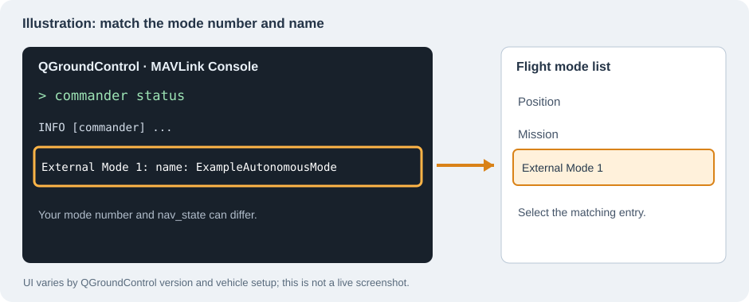

# Example autonomous mode

This example pairs a PX4 external mode with an executor. The executor arms, requests PX4's native takeoff, schedules the mode, requests native landing, then waits for PX4 to disarm. While scheduled, the mode holds position and makes a short controlled descent. There is no optical-flow initialization; this aircraft no longer has that sensor.

Start with [External Modes](../../general_docs/external_modes.md) if registration, setpoints, or mode executors are new to you. A simple mode can be selected by the pilot after takeoff. This example includes an executor because it needs to sequence PX4 operations around the custom setpoint behavior, like the drogue-flight workflow.

> Selecting this mode starts an automatic arm and takeoff. Try it in SITL first. For initial hardware integration, remove the propellers and keep a pilot ready to take over. Check PX4's configured native-takeoff altitude before flight.

## How the pieces fit

`ExampleAutonomousModeExecutor` owns arm, native takeoff with the vehicle's configured altitude, `scheduleMode()`, native land, and `waitUntilDisarmed()`. `ExampleAutonomousMode` owns the continuous NED setpoints during hold and descent. The executor does not send a disarm command: PX4's landing/disarm behavior and settings own that step. A pilot takeover or failsafe produces a non-success mode result, and the executor does not then issue a new landing command.



The executor calls `takeoff()` without an altitude override, so PX4 uses its configured native-takeoff altitude. The mode starts only after PX4 reports that takeoff has completed. Set the vehicle's takeoff altitude in PX4 before flying; no optical-flow height or settling delay is required.

`VehicleLandDetected` is an optional input to this example, not a heartbeat or a requirement for every external mode. A landed sample before takeoff supplies the ground z used for the controlled-descent handoff. If no sample arrives, the mode skips that segment and asks PX4 to perform native landing after the hold. PX4 handles touchdown detection and disarming; the mode does not infer touchdown from loss of messages. `/drone_state` and `/tracking_error` are optional debugging outputs, not requirements for mode registration or flight.

## Build and run

PX4 or SITL, the Micro XRCE-DDS agent, the message translation node used by this repository, ROS 2 Humble, `px4_msgs`, and `px4_ros2_cpp` must be available. See the [workspace README](../../README.md) for setup.

```bash
source /opt/ros/humble/setup.bash
colcon build --packages-up-to example_autonomous_mode
source install/setup.bash
ros2 launch example_autonomous_mode example_autonomous_mode.launch.py
```

Wait for successful registration, then select **ExampleAutonomousMode** in QGroundControl. The executor is allowed to activate while disarmed so it can arm, but launching the node alone does not select the mode. In QGroundControl's MAVLink Console, `commander status` prints an `External Mode N` entry with the registered name. Match that number to the external-mode entry in the flight-mode list or switch assignment. PX4's [control-interface guide](https://docs.px4.io/v1.16/en/ros2/px4_ros2_control_interface) documents the mapping.



This is an annotated sketch, not a screenshot of a live vehicle; the menu varies by QGroundControl version and setup.

The mode and executor both call `setSkipMessageCompatibilityCheck()`. They register independently, and this repository uses a PX4/`px4_msgs` version translation path. These calls are required for this checkout; removing either one can make registration fail. They do not replace the translation node or make arbitrary message versions compatible.

## Parameters and topics

[`cfg/example_autonomous_mode_params.yaml`](cfg/example_autonomous_mode_params.yaml) supplies the run-time values. Its top-level key must match the node name in the launch file. Edit the YAML and rebuild this package before launching with the changed file.

| Parameter | Default | Meaning |
| --- | ---: | --- |
| `hold_duration` | 7.5 s | Time at the reached position. |
| `descent_vel` | 0.5 m/s | Positive-down NED speed during controlled descent. |
| `landing_height` | 0.10 m | Height above the observed ground plane where PX4 native landing takes over. |

| Topic | Use |
| --- | --- |
| `/fmu/out/vehicle_local_position_v1` | Mode's local position through `OdometryLocalPosition` in this checkout. |
| `/fmu/out/vehicle_land_detected` | Optional preflight ground sample and descent stop signal. |
| `/drone_state` | Optional state-transition messages. |
| `/tracking_error` | Optional commanded-minus-actual NED position while using position setpoints. |

PX4 local position is **NED**: x is north, y is east, and z grows downward. Climbing decreases z; positive z velocity descends.


The tracking-error message uses `frame_id = "odom"` but its components follow those local NED axes. During velocity-controlled descent it is not published.

## Using the classes in another package

Copy `ExampleAutonomousMode.hpp` and `ExampleAutonomousMode.cpp` into your ROS 2 package. Add the `.cpp` to your `add_executable(...)` source list. Bring over the `find_package(...)` and `ament_target_dependencies(...)` entries for `rclcpp`, `Eigen3`, `px4_ros2_cpp`, `px4_msgs`, `std_msgs`, and `geometry_msgs` from this package's [`CMakeLists.txt`](CMakeLists.txt). Copy the YAML and launch file only if you want this parameter-loading and launch setup; update their package, executable, and node names together.

Rename the classes, namespace, and `kExampleAutonomousModeName`. PX4 stores the registered name in a [`char[25]` field](../px4_msgs/msg/RegisterExtComponentRequest.msg), and the [registration code](../px4-ros2-interface-lib/px4_ros2_cpp/src/components/registration.cpp) rejects names of 25 or more characters. Choose a unique name of at most 24 characters.

Add mission states to `State`, `updateSetpoint()`, and `stateName()`. Use `switchToState()` so dwell time and `/drone_state` update together. Keep a setpoint flowing while your state is active; `commandPosition()` also publishes the optional tracking error. Put new continuous mission behavior between `Holding` and `Finished`, and add executor states when you need another PX4 operation. Keep the non-success result path from automatically issuing landing after a pilot takeover.

The interface library's [`SetpointBase::desiredUpdateRateHz()`](../px4-ros2-interface-lib/px4_ros2_cpp/include/px4_ros2/common/setpoint_base.hpp) requests 50 Hz by default. Its [mode timer](../px4-ros2-interface-lib/px4_ros2_cpp/src/components/mode.cpp) passes measured elapsed seconds to `updateSetpoint(float dt_s)`; scheduler timing can vary. Use `dt_s` for integration rather than assuming each call is exactly 0.02 seconds. PX4 may trigger a failsafe when the active mode becomes unresponsive or stops supplying required setpoints. The resulting action depends on vehicle configuration; it is not an automatic disarm simply because one heartbeat is missed. See the [PX4 failsafe and mode-requirements guide](https://docs.px4.io/v1.17/en/ros2/px4_ros2_control_interface#failsafes-and-mode-requirements).
